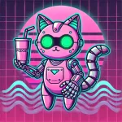

### DISCLAIMER ⚠️

<strong>This is an independent fan project and is NOT officially affiliated with Dinky Pod in any way</strong>

# DinkyBot

(*please someone make better art*)

Made with ❤️ by Neill for the Dinky Podcast community 

https://dinkypod.com

## About DinkyBot
DinkyBot is a custom Discord bot created for the Dinky Podcast community, written in [Python](https://www.python.org). Huge shout out to the crew over at [Discord.py](https://github.com/Rapptz/discord.py) for making this easy and fun ❤️     
It's designed to add fun and utility to the Discord server. Right now it only has very basic functions such as posting GIFs related to community in-jokes, but my hope is that it can grow organically to serve the community. The sky is the limit!

Have an idea? Put in a [feature suggestion](https://github.com/leftydrummer/dinkybot/issues/new?template=feature_suggestion.yml)!

## Adding to Discord
The bot can be invited to be added to a server with the link below:

[Add Me to Discord 😎](https://discord.com/oauth2/authorize?client_id=1344839681929379880)

<footer>
Join the Dinky Podcast community to interact with DinkyBot and connect with fellow DINKs and SINKs!
</footer>